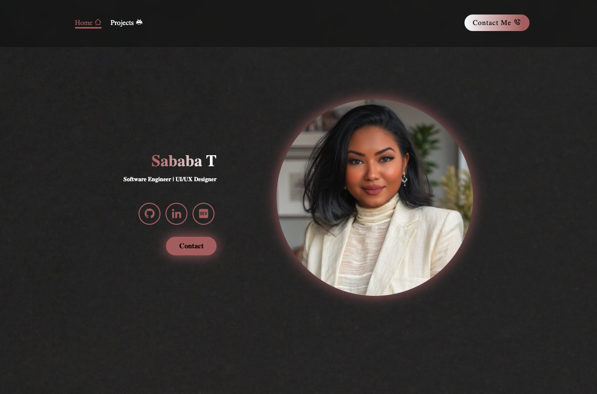
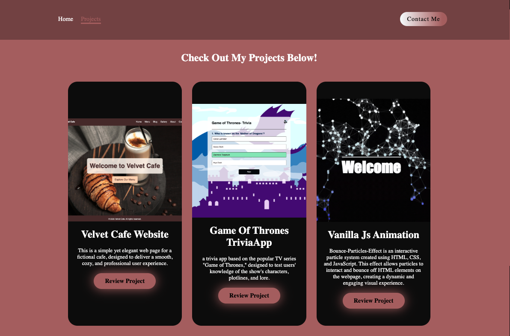
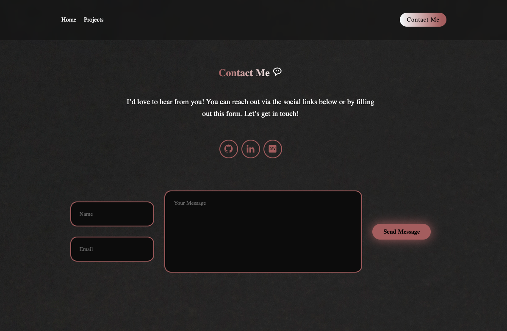
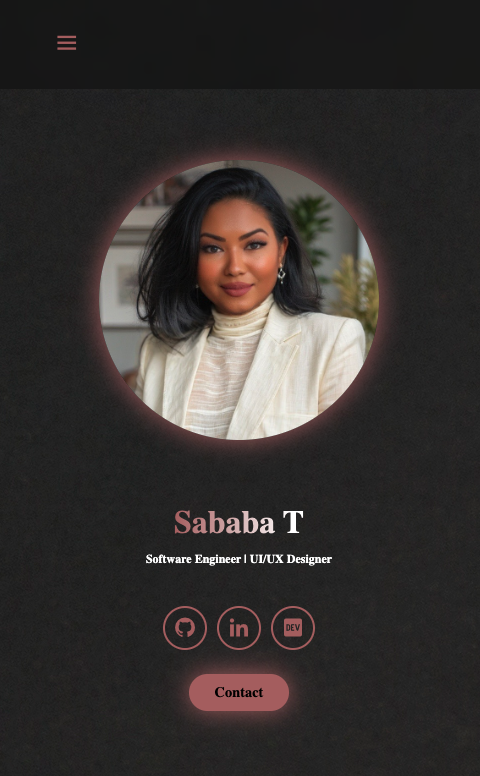
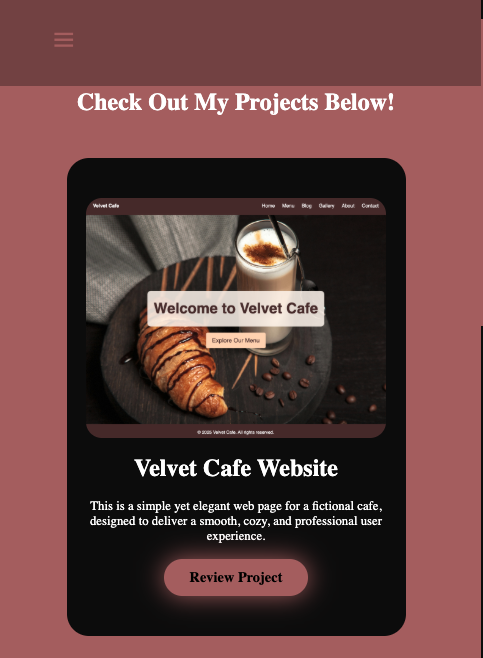
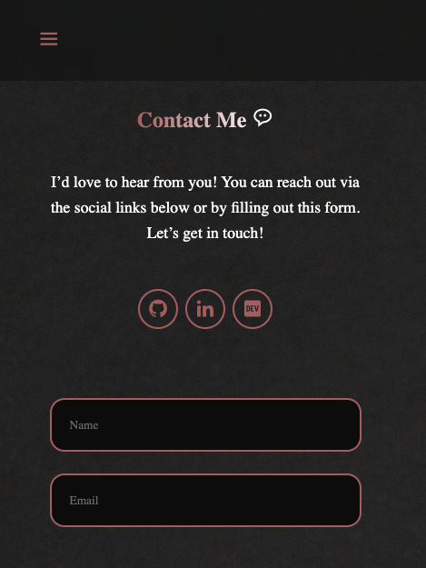
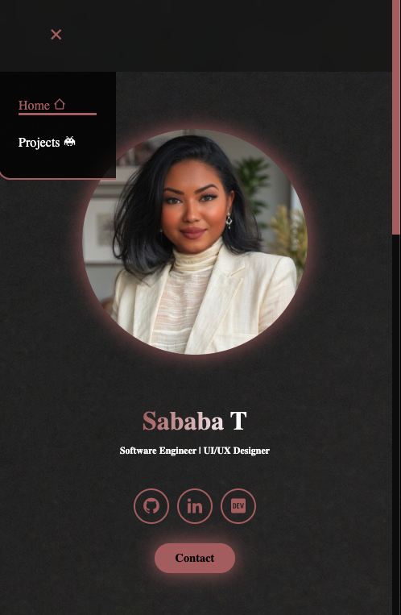
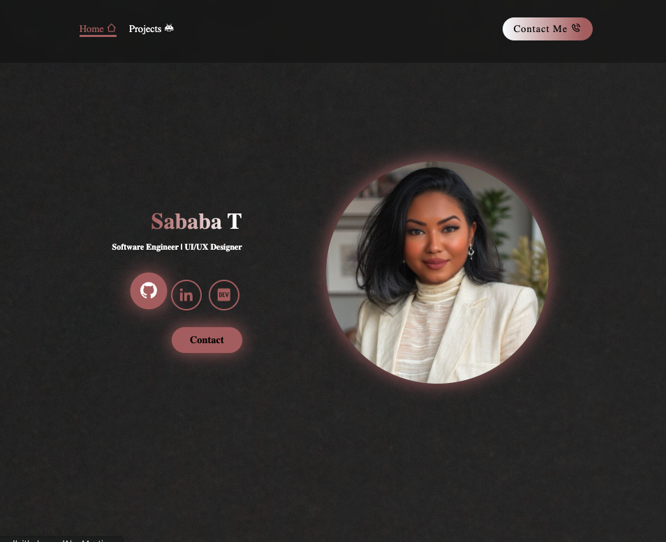

# Sababa Tasnim – Portfolio Website

[View the Live Site](https://algomystique.github.io/She-Codes-Syd-Portfolio-Project)

This repository contains my personal portfolio website, built to showcase my background, projects, and contact details in a clean and approachable way. The site focuses on simplicity, accessibility, and responsiveness, ensuring it works well across all screen sizes. I designed it with a minimal aesthetic, using soft colours and clear typography to keep the content easy to read and navigate.

---

## 📝 Overview

The website is made up of three main pages:

- **Home** – Includes my profile picture and a detailed biography introducing who I am and what I do.  
- **Projects** – Highlights selected projects I’ve worked on, with descriptions and links.  
- **Contact** – A fully functional contact form powered by **Basin**, allowing visitors to send messages directly to my inbox.

I also added links to my **GitHub** and **LinkedIn** profiles so users can explore more of my work and professional background.

## 📄 Contents

This portfolio includes the below content elements:

- [x] Profile picture 
- [x] 100+ word biography  
- [x] Working contact form (Basin)  
- [x] Projects section  
- [x] Links to external sites (GitHub, LinkedIn, DevCommunity)

## 🛠️ Technical Features

The site is built with a focus on clean structure and maintainability:

- **Semantic HTML** for better accessibility and SEO  
- **Responsive design**, adapting to mobile, tablet, and desktop  
- **JavaScript hamburger menu** for smooth mobile navigation  
- Fully **version controlled with Git**  
- Deployed via **GitHub Pages**  
- Includes **three web pages** (Home, Projects, Contact)

## ✨ Bonus Features

To enhance the user experience, I added:

- **Hover, active, and focus styles** on navigation and buttons  
- **JavaScript interactions**, including the responsive hamburger menu  
- Consistent, minimal visual design across all pages  

## Screenshots

### 1️⃣ Desktop Version

#### Home – Desktop

#### Projects – Desktop

#### Contact – Desktop

---

### 2️⃣ Mobile Version

#### Home – Mobile

#### Projects – Mobile

#### Contact – Mobile

---

### 3️⃣ Special Effects / Interactions

#### Hamburger Menu Open

#### Button Hover State

---

If you like what you see, let’s connect!  

- [LinkedIn](https://www.linkedin.com/in/sababat)  
- [GitHub](https://github.com/AlgoMystique)
- Or send me a message via the contact form on the site.
